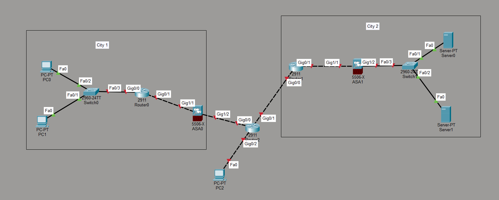

# Networking Devices Overview

> **Lab Folder:** `Day-01-Networking-Devices`

---

## 🎯 Objective

Identify and configure routers, switches, and end devices in Packet Tracer.

---

## 🖼️ Topology Preview



> _(Topology image added)_

---

## 🖥️ Key CLI Commands

```bash
! ─────────────────────────────────────────────
! Example commands for: Networking Devices Overview
! ─────────────────────────────────────────────

! Replace the placeholders below with actual commands from your lab.
enable
configure terminal

! TODO: Add your key configuration commands here

end
```

---

## ✅ Verification Steps

| Step | Command | Expected Output |
|------|---------|----------------|
| 1 | `show ip interface brief` | All interfaces Up/Up |
| 2 | `ping <destination>` | Success rate 100% |
| 3 | _(add more steps…)_ | _(expected result)_ |

---

## 📝 Notes

- **Lab Reflection:** Explored the fundamental components of a network. Learned the core functions and purposes of key hardware, including routers, switches, firewalls, servers, and end devices (PCs).
- Packet Tracer version used: **8.x**
- Date completed: **2026-08-19**

---

_Back to [Portfolio Root](../README.md)_
