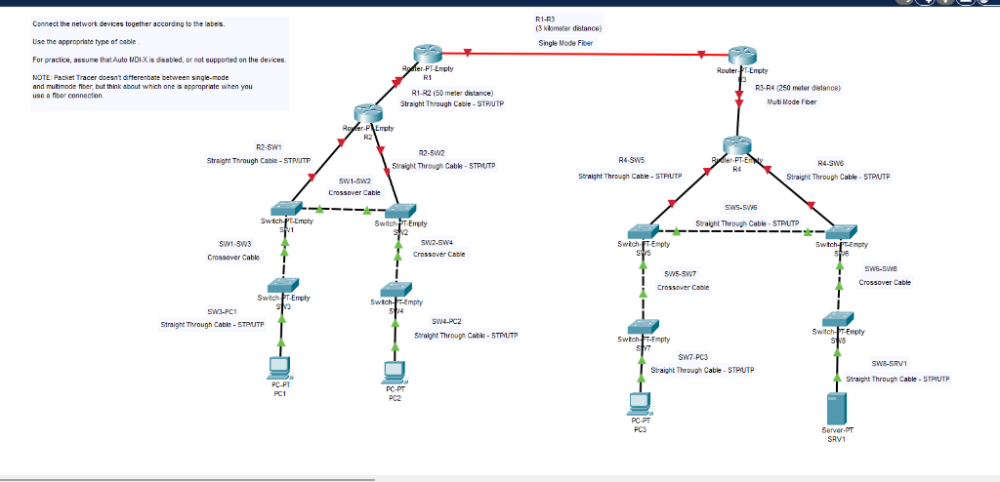

# Connecting Devices

> **Lab Folder:** `Day-02-Connecting-Devices`

---

## 🎯 Objective

Understand physical layer connectivity by selecting and applying the correct cable types (Straight-through, Crossover, and Fiber) to connect various networking devices, assuming Auto-MDIX is disabled.

---

## 🖼️ Topology Preview

---

## 👣 Step-by-Step Walkthrough

1. **Router to Router (Long Distance):** Connected R1 to R3 over a 3-kilometer distance using **Single Mode Fiber**, which is required for long-range transmission.
2. **Router to Router (Short Distance):** Connected R3 to R4 over a 250-meter distance using **Multi Mode Fiber**, which is suitable for shorter, high-bandwidth links.
3. **Router to Switch:** Connected Routers (e.g., R2, R4) to Switches using **Straight-Through Cables**. Since routers and switches operate at different OSI layers, their transmit and receive pins align naturally.
4. **Switch to Switch:** Connected Switches together (e.g., SW1 to SW2) using **Crossover Cables**. Because like-devices use the same transmit/receive pins, a crossover cable is necessary to cross the transmit signals to the receive pins. *(Note: We assumed Auto-MDIX was disabled for this practice).*
5. **Switch to PC/Server:** Connected end devices (PCs, Servers) to Switches using **Straight-Through Cables**.

*(Note: No CLI configurations were required for this physical cabling lab.)*

---

## 📝 Notes

- **Cable Types Summary:**
  - **Straight-Through (UTP/STP):** Connects *unlike* devices (e.g., Switch to Router, Switch to PC).
  - **Crossover (UTP/STP):** Connects *like* devices (e.g., Switch to Switch, Router to Router, PC to PC).
  - **Fiber Optic:** Used for high-speed, long-distance links or connecting different buildings. *Single-mode* is for very long distances (lasers), while *multi-mode* is for shorter distances (LEDs).
- Packet Tracer version used: **8.x**
- Date completed: **2026-08-19**

---

_Back to [Portfolio Root](../README.md)_
