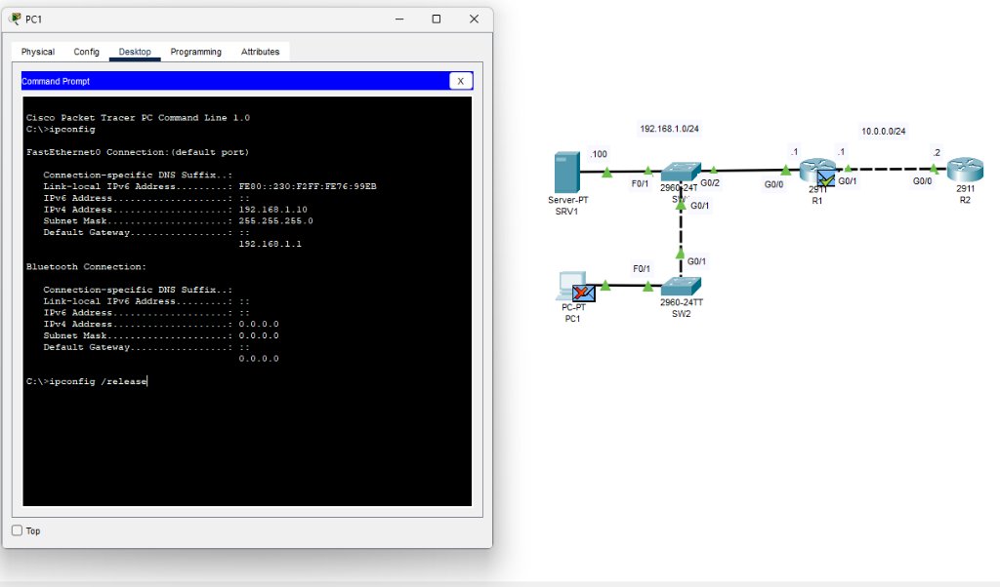
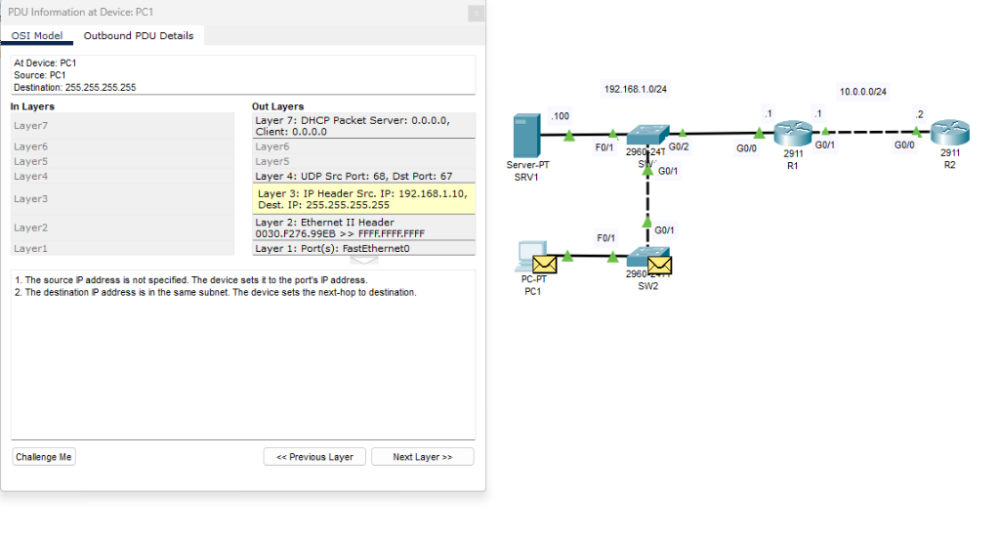

# OSI Model & Encapsulation

> **Lab Folder:** `Day-03-OSI-Model`

---

## 🎯 Objective

The objective of this exercise was to understand how data moves through the OSI Model by analyzing DHCP communication between a client device and a DHCP server.

Rather than simply memorizing the seven layers of the OSI Model, this lab focused on observing a real packet as it traveled through the network and identifying the role each layer plays in the communication process.

---

## 🖼️ Lab Walkthrough & Analysis

### 1. Generating Traffic (Releasing IP)

To trigger the process, I opened the command prompt on **PC1** and used the `ipconfig` command. 
- The initial `ipconfig` command showed the current network configuration.
- By issuing `ipconfig /release`, the PC prepares to drop its current IP and eventually send out new DHCP packets. This gave me a real Protocol Data Unit (PDU) to track in Packet Tracer's Simulation Mode.

### 2. Inspecting the PDU OSI Layers

By clicking on the envelope (PDU) on PC1 in Simulation Mode, I was able to see exactly how the data is encapsulated at each layer before it goes out on the wire:

- **Layer 7 (Application):** The packet is identified as a **DHCP Packet** communicating with the server.
- **Layer 4 (Transport):** Shows **UDP** being used, with Source Port `68` (DHCP Client) and Destination Port `67` (DHCP Server).
- **Layer 3 (Network):** Shows the **IP Header**. The destination IP is `255.255.255.255` (a broadcast, since it needs to find the DHCP server).
- **Layer 2 (Data Link):** Shows the **Ethernet II Header**. The destination MAC address is `FFFF.FFFF.FFFF` (a Layer 2 broadcast), ensuring the switch floods the frame out to all ports so the server will receive it.
- **Layer 1 (Physical):** The data is sent out of the **FastEthernet0** port onto the physical connection.

---

## 📝 Notes

- **Lab Reflection:** Seeing the OSI model in action makes the abstract layers concrete. It's incredibly helpful to physically click on a packet and read its headers at Layers 2, 3, 4, and 7 simultaneously to understand how devices read and write encapsulation headers.
- Packet Tracer version used: **8.x**
- Date completed: **2026-08-19**

---

_Back to [Portfolio Root](../README.md)_
