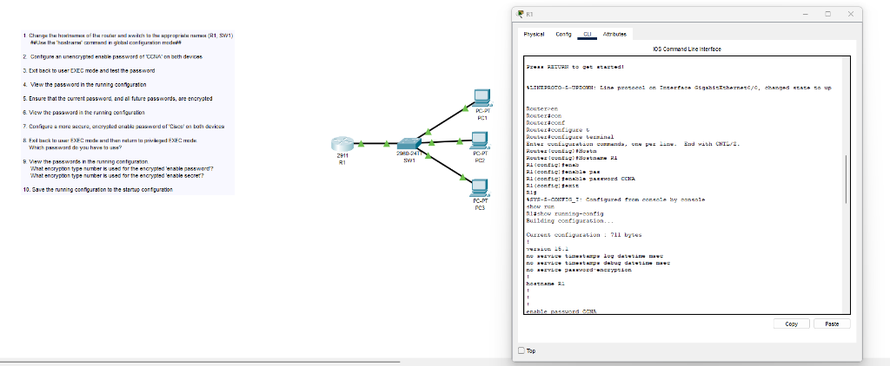
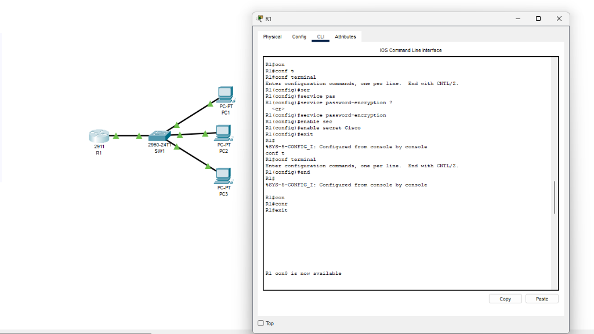
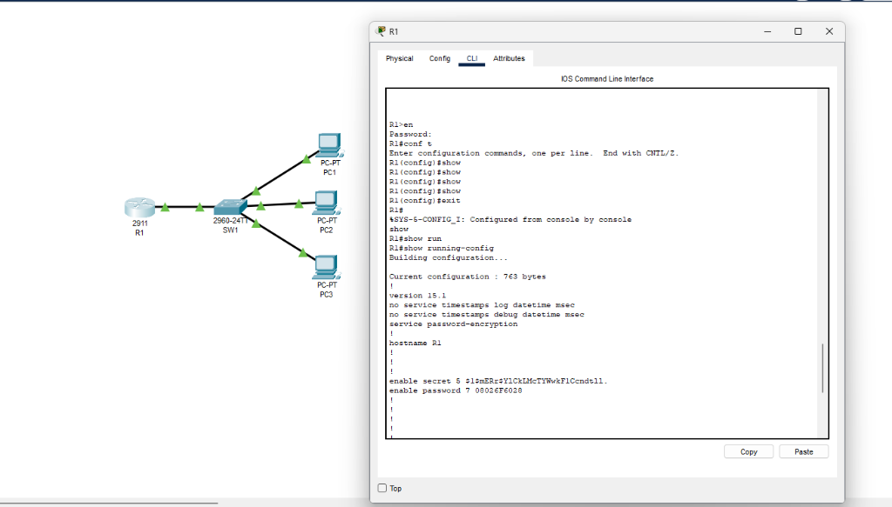
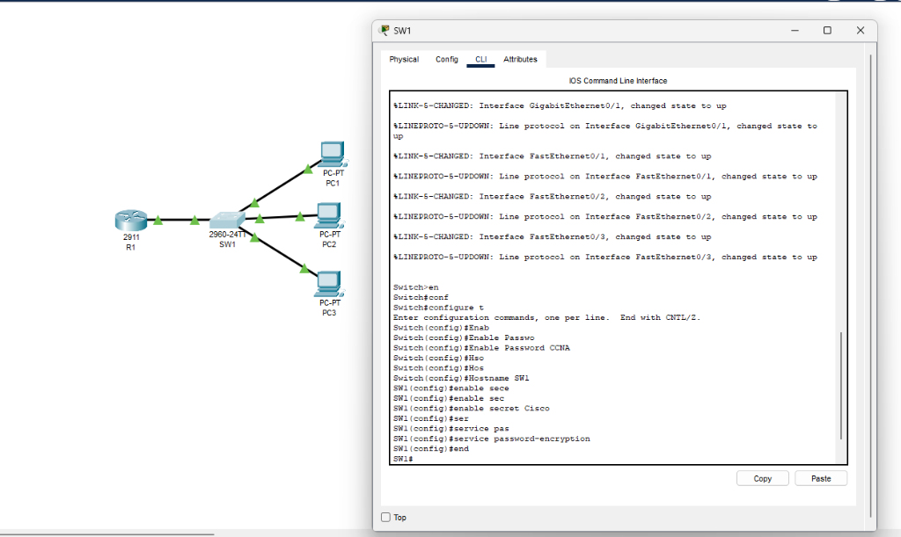

# Basic Network Security

> **Lab Folder:** `Day-04-Basic-Network-Security`

---

## 🎯 Objective

Learn fundamental Cisco IOS device hardening by configuring hostnames, setting up basic passwords, and implementing password encryption on routers and switches.

---

## 🖼️ Lab Walkthrough & Analysis

This lab followed a 10-step process to secure access to the privileged EXEC mode on both a router (`R1`) and a switch (`SW1`).

### 1. Initial Configuration & Unencrypted Passwords

- **Hostnames:** First, I used `hostname R1` and `hostname SW1` in global configuration mode to assign proper names to the devices instead of the default "Router" and "Switch".
- **Plaintext Password:** I set an initial unencrypted password using the `enable password CCNA` command. 
- **Verification:** Running `show run` revealed a major security flaw: the `enable password CCNA` was fully visible in plain text within the configuration file.

### 2. Securing the Configuration

To fix the plaintext password vulnerability, I applied two security measures:
- **Service Password-Encryption:** I issued `service password-encryption`. This command scrambles the plaintext "CCNA" password inside the configuration file.
- **Enable Secret:** I configured a stronger, overriding password using `enable secret Cisco`. 

### 3. Verifying Encryption Types

Running `show run` again allowed me to compare the two methods:
- `enable secret 5 $1$mERr...`: The `5` indicates an **MD5 hash** (a highly secure, one-way hash algorithm).
- `enable password 7 0822...`: The `7` indicates Cisco's proprietary **Type 7 encryption** (easily reversible, but better than plain text for preventing shoulder-surfing). 
- *(Note: Because both are configured, the device will prompt for the `enable secret` password when entering privileged EXEC mode).*

### 4. Replicating on the Switch

I repeated the exact same hardening process on the switch (`SW1`), ensuring both critical network nodes were secured identically:
1. `hostname SW1`
2. `enable password CCNA`
3. `enable secret Cisco`
4. `service password-encryption`

---

## 🖥️ Key CLI Commands Used

```bash
! Set the device hostname
hostname <name>

! Set a plaintext privileged EXEC password
enable password <password>

! Set a strongly encrypted privileged EXEC password
enable secret <password>

! Encrypt all current and future plaintext passwords in the config
service password-encryption

! View the configuration to verify password hashes
show running-config
```

---

## 📝 Notes

- **Lab Reflection:** This lab practically demonstrated why `enable secret` is always preferred over `enable password`. While `service password-encryption` is a helpful global command to hide passwords from casual observers, Type 7 encryption is weak and easily cracked. Type 5 (MD5) or newer hashes provided by `enable secret` represent standard best practices for securing network devices.
- Packet Tracer version used: **8.x**
- Date completed: **2026-08-19**

---

_Back to [Portfolio Root](../README.md)_
