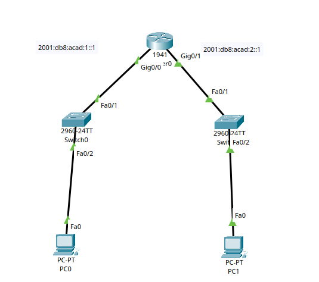
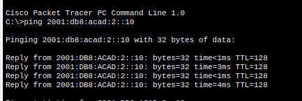

# IPv6 Addressing & Subnetting

> **Lab Folder:** `Day-05-IPv6-Addressing`

---

## 🎯 Objective

Understand the structure and mechanics of IPv6 addressing, master 4-bit (8-4-2-1) hexadecimal conversion and address compression rules, configure IPv6 routing and interface addressing on Cisco IOS, and verify end-to-end connectivity across subnets.

---

## 📖 Theoretical Fundamentals

### 1. IPv4 vs. IPv6 Key Differences

| Feature | IPv4 | IPv6 |
| :--- | :--- | :--- |
| **Address Length** | 32 bits (4 bytes) | **128 bits** (16 bytes) |
| **Notation** | Dotted decimal (e.g., `192.168.1.1`) | Hexadecimal hextets (e.g., `2001:db8:acad:1::1`) |
| **Total Address Space** | $\approx 4.29 \times 10^9$ ($2^{32}$) | $\approx 3.4 \times 10^{38}$ ($2^{128}$) |
| **Subnet Mask Format** | Dotted decimal (e.g., `255.255.255.0`) or `/24` | Prefix length only (e.g., `/64`) |
| **Address Resolution** | ARP (Address Resolution Protocol - Broadcast) | NDP (Neighbor Discovery Protocol - Multicast) |
| **Packet Types** | Unicast, Multicast, Broadcast | Unicast, Multicast, **Anycast** (No Broadcast) |
| **NAT Necessity** | Mandatory for scaling due to exhaustion | Not required (end-to-end global addressing) |
| **Auto-Configuration** | DHCPv4 or Manual | SLAAC, DHCPv6 (Stateless / Stateful), or Manual |

---

### 2. Binary & Hexadecimal Conversion (The 8-4-2-1 Rule)

Every IPv6 address consists of **128 bits**, divided into **8 hextets** (16 bits each).
Each hextet contains **4 hexadecimal digits**, and each hexadecimal digit represents a **4-bit nibble** evaluated by positional values $8 - 4 - 2 - 1$:

| Hex Digit | Decimal Value | 8 | 4 | 2 | 1 | Binary (Nibble) |
| :---: | :---: | :---: | :---: | :---: | :---: | :---: |
| **0** | 0 | 0 | 0 | 0 | 0 | `0000` |
| **1** | 1 | 0 | 0 | 0 | 1 | `0001` |
| **2** | 2 | 0 | 0 | 1 | 0 | `0010` |
| **3** | 3 | 0 | 0 | 1 | 1 | `0011` |
| **4** | 4 | 0 | 1 | 0 | 0 | `0100` |
| **5** | 5 | 0 | 1 | 0 | 1 | `0101` |
| **6** | 6 | 0 | 1 | 1 | 0 | `0110` |
| **7** | 7 | 0 | 1 | 1 | 1 | `0111` |
| **8** | 8 | 1 | 0 | 0 | 0 | `1000` |
| **9** | 9 | 1 | 0 | 0 | 1 | `1001` |
| **A** | 10 | 1 | 0 | 1 | 0 | `1010` |
| **B** | 11 | 1 | 0 | 1 | 1 | `1011` |
| **C** | 12 | 1 | 1 | 0 | 0 | `1100` |
| **D** | 13 | 1 | 1 | 0 | 1 | `1101` |
| **E** | 14 | 1 | 1 | 1 | 0 | `1110` |
| **F** | 15 | 1 | 1 | 1 | 1 | `1111` |

#### Example: Decoding `2001:DB8:ACAD:1::1`
Let's convert the hextets into binary using 8-4-2-1:
* `2` = `0010`, `0` = `0000`, `0` = `0000`, `1` = `0001` $\rightarrow$ `0010 0000 0000 0001`
* `D` (13) = `1101`, `B` (11) = `1011`, `8` = `1000` $\rightarrow$ `0000 1101 1011 1000` (`0DB8`)
* `A` (10) = `1010`, `C` (12) = `1100`, `A` = `1010`, `D` = `1101` $\rightarrow$ `1010 1100 1010 1101` (`ACAD`)

---

### 3. Rules for Compressing IPv6 Addresses

IPv6 addresses are long, so two compression rules are standardized (RFC 5952):

1. **Rule 1: Omit Leading Zeros**
   - Leading zeros in any 16-bit hextet can be dropped.
   - Example: `:0001:` becomes `:1:`, `:0db8:` becomes `:db8:`, `:0000:` becomes `:0:`.
2. **Rule 2: Double Colon (`::`) for Consecutive Zero Hextets**
   - A single contiguous sequence of all-zero hextets can be replaced with `::`.
   - **Important:** `::` can only be used **once** per address to prevent ambiguous expansion.

#### Step-by-Step Compression Examples:

| Preferred (Full 32 Hex Digits) | Step 1 (Omit Leading Zeros) | Step 2 (Double Colon `::`) | Description |
| :--- | :--- | :--- | :--- |
| `2001:0db8:acad:0001:0000:0000:0000:0001` | `2001:db8:acad:1:0:0:0:1` | `2001:db8:acad:1::1` | Global Unicast Address |
| `2001:0db8:acad:0002:0000:0000:0000:0010` | `2001:db8:acad:2:0:0:0:10` | `2001:db8:acad:2::10` | Host Address |
| `fe80:0000:0000:0000:0000:0000:0000:0001` | `fe80:0:0:0:0:0:0:1` | `fe80::1` | Link-Local Address |
| `0000:0000:0000:0000:0000:0000:0000:0001` | `0:0:0:0:0:0:0:1` | `::1` | Loopback Address |
| `0000:0000:0000:0000:0000:0000:0000:0000` | `0:0:0:0:0:0:0:0` | `::` | Unspecified / Default Route |

---

## 🖼️ Topology & Lab Walkthrough

### Topology Overview
The topology consists of a Cisco 1941 Router interconnecting two separate IPv6 subnets through 2960 switches to end PCs:



* **Subnet A (LAN 1):** `2001:db8:acad:1::/64`
  * Router `GigabitEthernet0/0`: `2001:db8:acad:1::1/64`
  * Host `PC0`: `2001:db8:acad:1::10/64` (Gateway: `2001:db8:acad:1::1`)
* **Subnet B (LAN 2):** `2001:db8:acad:2::/64`
  * Router `GigabitEthernet0/1`: `2001:db8:acad:2::1/64`
  * Host `PC1`: `2001:db8:acad:2::10/64` (Gateway: `2001:db8:acad:2::1`)

---

### ⚠️ Subnet Overlap Error & Resolution

During initial interface configuration, attempting to assign `2001:db8:acad:1::2/64` to `GigabitEthernet0/0` resulted in:
```text
%GigabitEthernet0/0: Error: 2001:DB8:ACAD:1::/64 is overlapping with 2001:DB8:ACAD:1::/64 on GigabitEthernet0/1
```

**Why this happened:**
* With a prefix length of `/64`, the first 4 hextets (`2001:db8:acad:1::/64`) represent the **Network Prefix (Subnet ID)**.
* Cisco IOS requires every routed interface to belong to a **unique network prefix**.
* Because `GigabitEthernet0/1` was already assigned to the `2001:db8:acad:1::/64` network, assigning another address within the same prefix to `GigabitEthernet0/0` violates routing fundamentals.

**Resolution:**
Assign `GigabitEthernet0/0` to Subnet 1 (`2001:db8:acad:1::1/64`) and `GigabitEthernet0/1` to Subnet 2 (`2001:db8:acad:2::1/64`).

---

## 🖥️ Clean Cisco IOS Configuration

```bash
! Enter privileged EXEC mode and configuration mode
enable
configure terminal

! Enable IPv6 routing on the router (Mandatory for routing IPv6 packets)
ipv6 unicast-routing

! Configure Interface GigabitEthernet0/0 (Subnet 1 - Left LAN)
interface GigabitEthernet0/0
 description LAN-1-Segment
 ipv6 address 2001:db8:acad:1::1/64
 no shutdown
exit

! Configure Interface GigabitEthernet0/1 (Subnet 2 - Right LAN)
interface GigabitEthernet0/1
 description LAN-2-Segment
 ipv6 address 2001:db8:acad:2::1/64
 no shutdown
exit

! Return to privileged EXEC and save configuration
end
copy running-config startup-config
```

---

## ✅ Verification & Connectivity

### Verification Commands

| Command | Purpose |
| :--- | :--- |
| `show ipv6 interface brief` | Verify IPv6 global unicast and link-local addresses and interface status (Up/Up) |
| `show ipv6 route` | Display the IPv6 routing table showing connected (`C`) and local (`L`) prefixes |
| `ping <ipv6-address>` | Test ICMPv6 connectivity |

### End-to-End Ping Test
Ping from `PC0` (`2001:db8:acad:1::10`) across the router to `PC1` (`2001:db8:acad:2::10`):



```text
C:\>ping 2001:db8:acad:2::10

Pinging 2001:db8:acad:2::10 with 32 bytes of data:

Reply from 2001:DB8:ACAD:2::10: bytes=32 time<1ms TTL=128
Reply from 2001:DB8:ACAD:2::10: bytes=32 time=3ms TTL=128
Reply from 2001:DB8:ACAD:2::10: bytes=32 time<1ms TTL=128
Reply from 2001:DB8:ACAD:2::10: bytes=32 time=4ms TTL=128

Ping statistics for 2001:DB8:ACAD:2::10:
    Packets: Sent = 4, Received = 4, Lost = 0 (0% loss)
```

---

## 📝 Notes & Key Takeaways

- **`ipv6 unicast-routing`**: By default, Cisco routers do not forward IPv6 packets. Running `ipv6 unicast-routing` in global configuration mode enables IPv6 routing and allows the router to send ICMPv6 Router Advertisements (RA).
- **Link-Local Addresses (`FE80::/10`)**: Automatically generated on every IPv6-enabled interface, used for local link communication (NDP, next-hop routing).
- Packet Tracer version used: **8.x / 9.x**
- Date completed: **2026-08-23**

---

_Back to [Portfolio Root](../README.md)_
