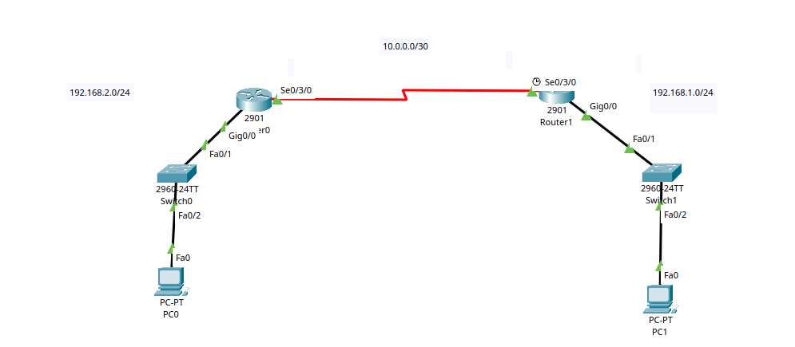
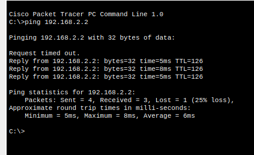

# Static Routing

> **Lab Folder:** `Day-06-Static-Routing`

---

## 🎯 Objective

Configure static routes between two Cisco routers over a serial link to allow communication between two separate LAN subnets (`192.168.1.0/24` and `192.168.2.0/24`).

---

## 📖 Theoretical Fundamentals

### What is Static Routing?
- **Definition:** Routers only know about networks that are **directly connected** to their own interfaces by default. To reach a remote network across another router, we must manually configure a **static route**.
- **The `ip route` Command Syntax:**
  ```text
  ip route <destination-network> <subnet-mask> <next-hop-ip>
  ```
  - `<destination-network>`: The remote network you want to reach (e.g., `192.168.1.0`).
  - `<subnet-mask>`: The subnet mask of the destination network (e.g., `255.255.255.0`).
  - `<next-hop-ip>`: The IP address of the neighboring router's incoming interface (e.g., `10.0.0.2`).

---

## 🖼️ Topology & Lab Walkthrough

### Topology Overview
The network connects two LANs through a point-to-point serial link:



* **LAN 1 (Left):** `192.168.2.0/24`
  * Router0 `GigabitEthernet0/0`: `192.168.2.1/24`
  * Host `PC0`: `192.168.2.2/24` (Default Gateway: `192.168.2.1`)
* **WAN Serial Link:** `10.0.0.0/30`
  * Router0 `Serial0/3/0`: `10.0.0.1 255.255.255.252`
  * Router1 `Serial0/3/0`: `10.0.0.2 255.255.255.252`
* **LAN 2 (Right):** `192.168.1.0/24`
  * Router1 `GigabitEthernet0/0`: `192.168.1.1/24`
  * Host `PC1`: `192.168.1.2/24` (Default Gateway: `192.168.1.1`)

---

## 🖥️ Clean Cisco IOS Configuration

### Router 0 (Left Router)

```bash
enable
configure terminal

! 1. Configure LAN Interface (Gig0/0)
interface GigabitEthernet0/0
 ip address 192.168.2.1 255.255.255.0
 no shutdown
exit

! 2. Configure WAN Serial Interface (Se0/3/0)
interface Serial0/3/0
 ip address 10.0.0.1 255.255.255.252
 no shutdown
exit

! 3. Configure Static Route to LAN 2 via Router 1
ip route 192.168.1.0 255.255.255.0 10.0.0.2

! 4. Save configuration
end
copy running-config startup-config
```

---

### Router 1 (Right Router)

```bash
enable
configure terminal

! 1. Configure LAN Interface (Gig0/0)
interface GigabitEthernet0/0
 ip address 192.168.1.1 255.255.255.0
 no shutdown
exit

! 2. Configure WAN Serial Interface (Se0/3/0)
interface Serial0/3/0
 ip address 10.0.0.2 255.255.255.252
 no shutdown
exit

! 3. Configure Static Route to LAN 1 via Router 0
ip route 192.168.2.0 255.255.255.0 10.0.0.1

! 4. Save configuration
end
copy running-config startup-config
```

---

## ✅ Verification & Connectivity

### End-to-End Ping Test
Ping from `PC1` (`192.168.1.2`) across the serial link to `PC0` (`192.168.2.2`):



```text
C:\>ping 192.168.2.2

Pinging 192.168.2.2 with 32 bytes of data:

Request timed out.
Reply from 192.168.2.2: bytes=32 time=5ms TTL=126
Reply from 192.168.2.2: bytes=32 time=8ms TTL=126
Reply from 192.168.2.2: bytes=32 time=5ms TTL=126

Ping statistics for 192.168.2.2:
    Packets: Sent = 4, Received = 3, Lost = 1 (25% loss),
    Approximate round trip times in milli-seconds:
    Minimum = 5ms, Maximum = 8ms, Average = 6ms
```

> **Note on Initial Timeout:** The first packet times out due to initial ARP address resolution along the path. Once resolved, subsequent packets succeed with 0% loss.

---

## 📝 Notes & Reflection

- Learned how to configure static IP addresses on LAN and Serial WAN interfaces.
- Configured `/30` point-to-point subnets (`255.255.255.252`) between routers.
- Successfully implemented static routes on both routers, enabling bidirectional traffic between separate subnets.
- Packet Tracer version used: **8.x / 9.x**
- Date completed: **2026-08-24**

---

_Back to [Portfolio Root](../README.md)_
