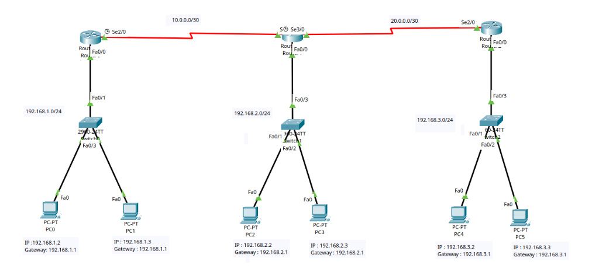
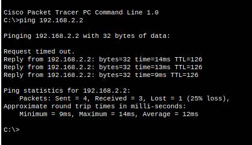

# RIP (Routing Information Protocol)

> **Lab Folder:** `Day-07-RIP`

---

## 🎯 Objective

Configure dynamic routing using **RIP (Routing Information Protocol)** across a multi-router topology (3 Routers, 3 Switches, and 6 PCs) to enable end-to-end communication without manual static route definitions.

---

## 📖 Theoretical Fundamentals

### What is RIP (Routing Information Protocol)?
- **Dynamic Routing:** Unlike static routing where each route is entered manually, dynamic routing protocols allow routers to automatically discover remote networks, share routing tables, and adapt to network topology changes.
- **Distance Vector Protocol:** RIP is a distance vector routing protocol designed for small-to-medium-sized networks.
- **Metric (Hop Count):** RIP determines the best path to a destination network based solely on the number of **hops** (routers) a packet must traverse.
  - **Maximum Hop Count:** 15 hops. A hop count of 16 represents infinity (unreachable network), preventing routing loops.
- **Update Mechanism:** RIP periodically broadcasts or multicasts its routing table to neighboring routers every 30 seconds.

### Key RIP Commands
- **`router rip`**: Enters RIP routing protocol configuration mode in Cisco IOS.
- **`network <network-address>`**: Enables RIP on any local interface that belongs to the specified major classful network and advertises that network to neighboring routers.
- **`version 2`** *(Optional / Recommended)*: Switches from RIPv1 (broadcasts, classful) to RIPv2 (multicasts to `224.0.0.9`, supports VLSM and classless routing).
- **`no auto-summary`** *(RIPv2)*: Prevents automatic summarization at major classful network boundaries.

---

## 🖼️ Topology & Lab Walkthrough

### Topology Overview
The network connects three LANs across two WAN point-to-point serial links:



### Addressing Table

| Device | Interface | IP Address | Subnet Mask | Default Gateway | Connected To |
|--------|-----------|------------|-------------|-----------------|--------------|
| **Router0 (Left)** | `Fa0/0` | `192.168.1.1` | `255.255.255.0` (/24) | — | Switch0 `Fa0/1` (LAN 1) |
| | `Se2/0` | `10.0.0.1` | `255.255.255.252` (/30) | — | Router1 `Se3/0` (WAN 1) |
| **PC0** | `FastEthernet0` | `192.168.1.2` | `255.255.255.0` | `192.168.1.1` | Switch0 `Fa0/3` |
| **PC1** | `FastEthernet0` | `192.168.1.3` | `255.255.255.0` | `192.168.1.1` | Switch0 `Fa0/2` |
| **Router1 (Middle)**| `Fa0/0` | `192.168.2.1` | `255.255.255.0` (/24) | — | Switch1 `Fa0/3` (LAN 2) |
| | `Se3/0` | `10.0.0.2` | `255.255.255.252` (/30) | — | Router0 `Se2/0` (WAN 1) |
| | `Se2/0` (or Serial) | `20.0.0.1` | `255.255.255.252` (/30) | — | Router2 `Se2/0` (WAN 2) |
| **PC2** | `FastEthernet0` | `192.168.2.2` | `255.255.255.0` | `192.168.2.1` | Switch1 `Fa0/1` |
| **PC3** | `FastEthernet0` | `192.168.2.3` | `255.255.255.0` | `192.168.2.1` | Switch1 `Fa0/2` |
| **Router2 (Right)** | `Fa0/0` | `192.168.3.1` | `255.255.255.0` (/24) | — | Switch2 `Fa0/3` (LAN 3) |
| | `Se2/0` | `20.0.0.2` | `255.255.255.252` (/30) | — | Router1 (WAN 2) |
| **PC4** | `FastEthernet0` | `192.168.3.2` | `255.255.255.0` | `192.168.3.1` | Switch2 `Fa0/1` |
| **PC5** | `FastEthernet0` | `192.168.3.3` | `255.255.255.0` | `192.168.3.1` | Switch2 `Fa0/2` |

---

## 🖥️ Clean Cisco IOS Configuration

### Router 0 (Left Router)

```bash
enable
configure terminal

! 1. Configure Interfaces
interface FastEthernet0/0
 ip address 192.168.1.1 255.255.255.0
 no shutdown
exit

interface Serial2/0
 ip address 10.0.0.1 255.255.255.252
 no shutdown
exit

! 2. Configure Dynamic RIP Routing
router rip
 network 192.168.1.0
 network 10.0.0.0
exit

! 3. Save Configuration
end
copy running-config startup-config
```

---

### Router 1 (Middle Router)

```bash
enable
configure terminal

! 1. Configure Interfaces
interface FastEthernet0/0
 ip address 192.168.2.1 255.255.255.0
 no shutdown
exit

interface Serial3/0
 ip address 10.0.0.2 255.255.255.252
 no shutdown
exit

interface Serial2/0
 ip address 20.0.0.1 255.255.255.252
 no shutdown
exit

! 2. Configure Dynamic RIP Routing
router rip
 network 192.168.2.0
 network 10.0.0.0
 network 20.0.0.0
exit

! 3. Save Configuration
end
copy running-config startup-config
```

---

### Router 2 (Right Router)

```bash
enable
configure terminal

! 1. Configure Interfaces
interface FastEthernet0/0
 ip address 192.168.3.1 255.255.255.0
 no shutdown
exit

interface Serial2/0
 ip address 20.0.0.2 255.255.255.252
 no shutdown
exit

! 2. Configure Dynamic RIP Routing
router rip
 network 192.168.3.0
 network 20.0.0.0
exit

! 3. Save Configuration
end
copy running-config startup-config
```

---

## 🔍 Verification & Troubleshooting Commands

### 1. View Learned Routes
Check the routing table to verify dynamic routes learned via RIP (designated by the `R` code):
```bash
show ip route
```
*Sample output:*
```text
Gateway of last resort is not set

R    192.168.2.0/24 [120/1] via 10.0.0.2, 00:00:18, Serial2/0
R    192.168.3.0/24 [120/2] via 10.0.0.2, 00:00:18, Serial2/0
     10.0.0.0/30 is subnetted, 1 subnets
C       10.0.0.0 is directly connected, Serial2/0
C    192.168.1.0/24 is directly connected, FastEthernet0/0
```
> `[120/1]`: `120` is the Administrative Distance (AD) for RIP; `1` is the Hop Count.

### 2. Verify RIP Process & Timers
```bash
show ip protocols
```

---

## ✅ Connectivity Verification

### End-to-End Ping Test
Testing connectivity from a host across the network to `PC2` (`192.168.2.2`):



```text
C:\>ping 192.168.2.2

Pinging 192.168.2.2 with 32 bytes of data:

Request timed out.
Reply from 192.168.2.2: bytes=32 time=14ms TTL=126
Reply from 192.168.2.2: bytes=32 time=13ms TTL=126
Reply from 192.168.2.2: bytes=32 time=9ms TTL=126

Ping statistics for 192.168.2.2:
    Packets: Sent = 4, Received = 3, Lost = 1 (25% loss),
Approximate round trip times in milli-seconds:
    Minimum = 9ms, Maximum = 14ms, Average = 12ms
```

> **Note on Initial Timeout:** The first ping packet encounters a temporary delay/timeout due to ARP resolution across router boundaries. Once ARP tables are populated, subsequent packets succeed with low latency.

---

## 📝 Notes & Key Takeaways

- **Hop Count Metric:** RIP evaluates best paths purely by hop count rather than link bandwidth or latency.
- **Dynamic Propagation:** By entering `router rip` and issuing `network <network-address>`, routers automatically exchange route information without requiring explicit `ip route` statements for every remote subnet.
- **Convergence:** Routers converge automatically once all RIP network statements are declared and periodic updates are exchanged.
- Packet Tracer version used: **8.x / 9.x**
- Date completed: **2026-08-24**

---

_Back to [Portfolio Root](../README.md)_
