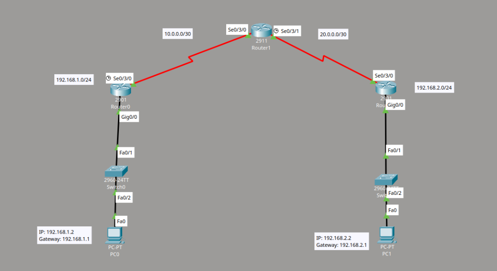
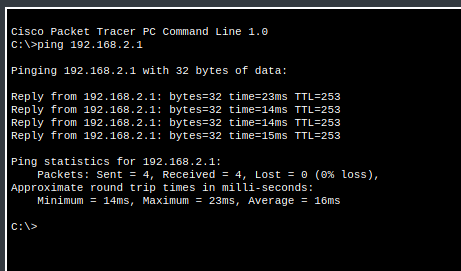

# EIGRP (Enhanced Interior Gateway Routing Protocol)

> **Lab Folder:** `Day-09-EIGRP`

---

## 🎯 Objective

Connect 3 routers across serial WAN links and configure **EIGRP** dynamic routing using Autonomous System (AS) 1 so all LANs and routers can communicate seamlessly.

---

## 📖 Theoretical Fundamentals

### What is EIGRP? (Beginner Summary)
- **What is EIGRP?** EIGRP stands for **Enhanced Interior Gateway Routing Protocol**. It is an advanced dynamic routing protocol developed by Cisco that is much faster and smarter than RIP.
- **How it works:**
  - Routers discover their directly connected neighbors and form an **adjacency** (neighbor relationship).
  - Instead of counting just hops, it calculates the best path based on metrics like **bandwidth and delay**.
  - It finds backup routes and updates rapidly using the **DUAL** (Diffusing Update Algorithm) engine.
- **Autonomous System (AS) Number:** All routers participating in EIGRP must share the exact same AS number (e.g., `router eigrp 1`) to form neighbor relationships and exchange routing information.
- **Wildcard Mask:** EIGRP uses wildcard masks with the `network` command (the inverse of a subnet mask, e.g., `/30` mask `255.255.255.252` becomes wildcard `0.0.0.3`, and `/24` mask `255.255.255.0` becomes `0.0.0.255`).

---

## 🖼️ Topology & Lab Walkthrough

### Topology Overview
The network connects two end-user LANs across 3 Cisco routers connected via serial links:



* **LAN 1 (Left):** `192.168.1.0/24` (Router0 `Gig0/0`: `192.168.1.1`, PC0: `192.168.1.2`, Gateway: `192.168.1.1`)
* **WAN 1 (Link Router0 - Router1):** `10.0.0.0/30` (Router0 `Se0/3/0`: `10.0.0.1`, Router1 `Se0/3/0`: `10.0.0.2`)
* **WAN 2 (Link Router1 - Router2):** `20.0.0.0/30` (Router1 `Se0/3/1`: `20.0.0.1`, Router2 `Se0/3/0`: `20.0.0.2`)
* **LAN 2 (Right):** `192.168.2.0/24` (Router2 `Gig0/0`: `192.168.2.1`, PC1: `192.168.2.2`, Gateway: `192.168.2.1`)

---

## 🖥️ Clean Cisco IOS Configuration

### Router 0 (Left Router - 2901)

```bash
enable
configure terminal

! 1. Configure Interfaces
interface GigabitEthernet0/0
 ip address 192.168.1.1 255.255.255.0
 no shutdown
exit

interface Serial0/3/0
 ip address 10.0.0.1 255.255.255.252
 clock rate 64000
 no shutdown
exit

! 2. Configure EIGRP Dynamic Routing
router eigrp 1
 network 192.168.1.0 0.0.0.255
 network 10.0.0.0 0.0.0.3
exit

! 3. Save Configuration
end
copy running-config startup-config
```

---

### Router 1 (Middle Router - 2911)

```bash
enable
configure terminal

! 1. Configure Interfaces
interface Serial0/3/0
 ip address 10.0.0.2 255.255.255.252
 no shutdown
exit

interface Serial0/3/1
 ip address 20.0.0.1 255.255.255.252
 clock rate 64000
 no shutdown
exit

! 2. Configure EIGRP Dynamic Routing
router eigrp 1
 network 10.0.0.0 0.0.0.3
 network 20.0.0.0 0.0.0.3
exit

! 3. Save Configuration
end
copy running-config startup-config
```

---

### Router 2 (Right Router - 2901)

```bash
enable
configure terminal

! 1. Configure Interfaces
interface GigabitEthernet0/0
 ip address 192.168.2.1 255.255.255.0
 no shutdown
exit

interface Serial0/3/0
 ip address 20.0.0.2 255.255.255.252
 no shutdown
exit

! 2. Configure EIGRP Dynamic Routing
router eigrp 1
 network 192.168.2.0 0.0.0.255
 network 20.0.0.0 0.0.0.3
exit

! 3. Save Configuration
end
copy running-config startup-config
```

---

## ✅ Verification & Connectivity

### End-to-End Ping Test
Testing end-to-end connectivity across all 3 routers by pinging the remote LAN gateway `192.168.2.1` from `PC0`:



```text
C:\>ping 192.168.2.1

Pinging 192.168.2.1 with 32 bytes of data:

Reply from 192.168.2.1: bytes=32 time=23ms TTL=253
Reply from 192.168.2.1: bytes=32 time=14ms TTL=253
Reply from 192.168.2.1: bytes=32 time=14ms TTL=253
Reply from 192.168.2.1: bytes=32 time=15ms TTL=253

Ping statistics for 192.168.2.1:
    Packets: Sent = 4, Received = 4, Lost = 0 (0% loss),
Approximate round trip times in milli-seconds:
    Minimum = 14ms, Maximum = 23ms, Average = 16ms
```

---

## 📝 Notes & What I Learnt

- **EIGRP Adjacency:** As soon as matching networks and AS numbers are entered, EIGRP forms neighbor relationships right away (seeing `%DUAL-5-NBRCHANGE: IP-EIGRP 1: Neighbor ... is up: new adjacency`).
- **Wildcard Masks:** Learned how to write wildcard masks for subnets (subtracting subnet mask from `255.255.255.255`, e.g., `/30` is `0.0.0.3` and `/24` is `0.0.0.255`).
- **Autonomous System (AS):** The AS number must match across all routers (we used AS `1`) for them to establish neighbor relationships and exchange routing tables.
- **Fast Convergence:** Routing updates happen almost instantaneously without long delays.
- Packet Tracer version used: **8.x / 9.x**
- Date completed: **2026-08-25**

---

_Back to [Portfolio Root](../README.md)_
