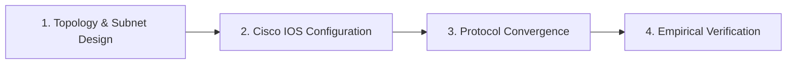

# Cisco Networking Engineering Labs

[](https://www.netacad.com/courses/packet-tracer)
[](https://www.cisco.com)
[](#lab-execution-matrix)
[](https://github.com/JaserHalabi)

> A practical portfolio of enterprise networking labs, Cisco IOS CLI configurations, routing and switching architectures, and empirical protocol verifications built and tested in **Cisco Packet Tracer**.

---

## Overview

This repository documents hands-on network implementations, architectural designs, and protocol validations. Rather than theoretical notes, every lab represents a functional network scenario featuring custom topology design, router and switch configuration via the Cisco IOS command-line interface (CLI), and end-to-end data plane testing.

### Core Engineering Competencies

- **Topology Engineering:** Multi-router, multi-switch network architectures with IPv4 and IPv6 subnetting schemes, including point-to-point /30 serial links.
- **Cisco IOS CLI Provisioning:** Production-grade configuration scripts for enterprise routers, Catalyst switches, and security appliances.
- **Routing and Switching:** Deployments of Static Routing, RIP v2, EIGRP, OSPF single/multi-area, VLAN segmentation (802.1Q), Inter-VLAN routing, and Spanning Tree Protocol (STP).
- **Device Hardening:** Security controls including enable secret hashing (MD5), service password-encryption, console and VTY transport restrictions, and login banners.
- **Verification and Diagnostics:** Data plane validation via ICMP reachability analysis, round-trip timing, ARP table inspection, and IOS state inspection (`show ip route`, `show ip protocols`, `show running-config`).

---

## Featured Implementations

Key hands-on labs completed and verified with topologies, configuration scripts, and connectivity captures:

| Lab | Engineering Focus | Key IOS Highlights | Verification Capture |
|---|---|---|---|
| **[EIGRP Dynamic Routing](./Day-09-EIGRP/)** | Dynamic routing across dual routers and multiple LAN subnets | `router eigrp <AS>`, `network <net> <wildcard>`, `no auto-summary` | [Topology & Ping Capture](./Day-09-EIGRP/ping-verification.png) |
| **[RIP Dynamic Routing](./Day-07-RIP/)** | Distance-vector protocol deployment and metric convergence | `router rip`, `version 2`, `network` statements | [Topology & Ping Capture](./Day-07-RIP/ping-verification.png) |
| **[Static Routing over Serial WAN](./Day-06-Static-Routing/)** | Point-to-point /30 serial link interconnecting isolated subnets | `interface Serial0/3/0`, `ip route <dest> <mask> <next-hop>` | [Topology & Ping Capture](./Day-06-Static-Routing/ping-verification.png) |
| **[IPv6 Addressing & Routing](./Day-05-IPv6-Addressing/)** | Dual-stack GUA configuration and neighbor discovery | `ipv6 address <GUA>/64`, `ipv6 enable` | [Topology & Ping Capture](./Day-05-IPv6-Addressing/ping-verification.png) |
| **[Switch Hardening & Device Security](./Day-04-Basic-Network-Security/)** | Layer 2 switch hardening and access control | `enable secret`, `service password-encryption`, `line vty 0 15` | [Verification Show Run](./Day-04-Basic-Network-Security/verification-show-run.png) |

---

## Lab Execution Matrix

| # | Lab Module | Architectural Focus | Status | Completed |
|---|---|---|:---:|:---:|
| 01 | [Hardware Identification & Device Interfacing](./Day-01-Networking-Devices/) | Interface layout and role definition for routers, switches, and firewalls | Complete | 2026-08-19 |
| 02 | [Physical Media & Cabling Standards](./Day-02-Connecting-Devices/) | Fiber (Single/Multi-Mode), Crossover, and Straight-Through deployment | Complete | 2026-08-19 |
| 03 | [OSI Protocol Analysis & PDU Inspection](./Day-03-OSI-Model/) | Packet inspection and protocol analysis across OSI layers | Complete | 2026-08-19 |
| 04 | [Switch Hardening & Line Security](./Day-04-Basic-Network-Security/) | Cisco switch security, secret hashing, and console/VTY access control | Complete | 2026-08-19 |
| 05 | [IPv6 Dual-Stack Addressing](./Day-05-IPv6-Addressing/) | Global Unicast Addressing (GUA) and IPv6 neighbor discovery | Complete | 2026-08-23 |
| 06 | [Dual-Router Static Routing over Serial WAN](./Day-06-Static-Routing/) | Point-to-point /30 serial WAN links and static routing tables | Complete | 2026-08-24 |
| 07 | [Dynamic Routing with RIP v2](./Day-07-RIP/) | Distance-vector protocol deployment and convergence testing | Complete | 2026-08-24 |
| 08 | [OSPF Single-Area Configuration](./Day-08-OSPF/) | Single-area OSPF, router IDs, and passive interfaces | Planned | — |
| 09 | [Enterprise Routing with EIGRP](./Day-09-EIGRP/) | Autonomous system routing, composite metric tuning, and convergence | Complete | 2026-08-25 |
| 10 | [VLAN Segmentation & Trunking](./Day-10-VLANs/) | IEEE 802.1Q trunking and broadcast domain separation | Planned | — |
| 11 | [Router-on-a-Stick Inter-VLAN Routing](./Day-11-Inter-VLAN-Routing/) | Sub-interface 802.1Q encapsulation and inter-VLAN traffic | Planned | — |
| 12 | [Spanning Tree Protocol (STP)](./Day-12-STP/) | Layer 2 loop prevention and root bridge election | Planned | — |
| 13 | [Link Aggregation via EtherChannel](./Day-13-EtherChannel/) | LACP and PAgP multi-link bundling and bandwidth aggregation | Planned | — |
| 14 | [Enterprise DHCP & Relay](./Day-14-DHCP/) | DHCP server pools, exclusions, and IP helper-address relay | Planned | — |
| 15 | [DNS Name Resolution](./Day-15-DNS/) | DNS records, domain hierarchy, and client resolution | Planned | — |
| 16 | [NAT & Port Address Translation](./Day-16-NAT/) | Static NAT, dynamic NAT pools, and overload (PAT) | Planned | — |
| 17 | [Access Control Lists (ACLs)](./Day-17-ACLs/) | Standard and extended numbered/named IP access lists | Planned | — |
| 18 | [Discovery Protocols (CDP & LLDP)](./Day-18-CDP-LLDP/) | Layer 2 device discovery and neighbor mapping | Planned | — |
| 19 | [Secure Administration (SSH & Telnet)](./Day-19-SSH-Telnet/) | Cryptographic key generation, SSHv2, and VTY restriction | Planned | — |
| 20 | [Network Time Protocol (NTP)](./Day-20-NTP/) | Stratum hierarchies and centralized time synchronization | Planned | — |
| 21 | [Centralized Logging & SNMP](./Day-21-Syslog-SNMP/) | Syslog severity levels and SNMP agent monitoring | Planned | — |
| 22 | [Point-to-Point WAN Encapsulation](./Day-22-WAN-PPP/) | PPP, CHAP/PAP authentication, and HDLC framing | Planned | — |
| 23 | [Frame Relay WAN Switching](./Day-23-Frame-Relay/) | Packet-switched WAN architectures and DLCI mapping | Planned | — |
| 24 | [Site-to-Site GRE Tunnels](./Day-24-GRE-Tunnels/) | Virtual point-to-point tunneling and tunnel interfaces | Planned | — |
| 25 | [Next-Gen IPv6 Dynamic Routing](./Day-25-IPv6-Routing/) | Dynamic IPv6 routing implementations (OSPFv3) | Planned | — |
| 26 | [Wireless LAN Infrastructure](./Day-26-Wireless-LAN/) | Wireless LAN Controllers (WLC) and Lightweight APs | Planned | — |
| 27 | [Port Security & DHCP Snooping](./Day-27-Port-Security/) | Layer 2 port security and DHCP snooping defense | Planned | — |
| 28 | [Quality of Service (QoS)](./Day-28-QoS/) | Traffic classification, marking, and queue prioritization | Planned | — |
| 29 | [Network Automation Fundamentals](./Day-29-Network-Automation/) | Programmability concepts, APIs, and configuration templates | Planned | — |
| 30 | [Enterprise Capstone Architecture](./Day-30-Capstone-Project/) | Comprehensive enterprise infrastructure deployment | Planned | — |

### Status Legend

| Status | Description |
|---|---|
| **Planned** | Lab scenario specified and scheduled for execution |
| **In Progress** | Topology construction and protocol validation underway |
| **Complete** | Configuration deployed, verified via diagnostics, and documented |

---

## Engineering Methodology



1. **Topology & Subnet Design:** Designing physical and logical architectures in Cisco Packet Tracer with precise IPv4/IPv6 address allocations.
2. **Cisco IOS Configuration:** Writing modular, production-ready CLI configuration scripts for routers, switches, and security appliances.
3. **Protocol Convergence:** Validating interface operational states (`show ip interface brief`), routing updates, and neighbor adjacencies (`show ip route`, `show ip protocols`).
4. **Empirical Verification:** Testing end-to-end data plane reachability using ICMP ping diagnostics, capturing round-trip statistics, and archiving test results.

---

## Repository Structure

```text
networking/
├── README.md                               ← Master portfolio dashboard (this file)
├── Day-06-Static-Routing/
│   ├── README.md                           ← Objective, topology layout, IOS CLI scripts, and analysis
│   ├── topology.png                        ← Exported Packet Tracer topology diagram
│   └── ping-verification.png               ← Evidence of ICMP reachability and round-trip timing
├── Day-09-EIGRP/
│   ├── README.md
│   ├── topology.png
│   └── ping-verification.png
└── ...
```

---

## Environment & Tooling

- **Simulation Platform:** [Cisco Packet Tracer](https://www.netacad.com/courses/packet-tracer) 8.x+
- **Emulated Hardware:** Cisco 2900 / 1941 ISR Routers, Catalyst 2960 Switches, Cisco ASA 5505 Firewalls
- **Configuration Interface:** Cisco IOS CLI
- **Diagnostics:** ICMP ping, traceroute, simulation-mode PDU packet tracing, IOS show commands

---

_Maintained by **[Jaser Halabi](https://github.com/JaserHalabi)**_
